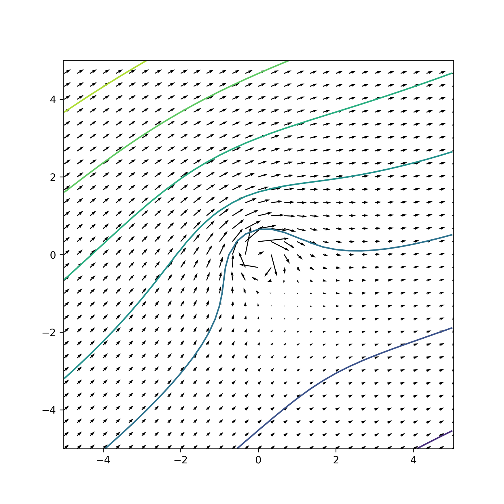
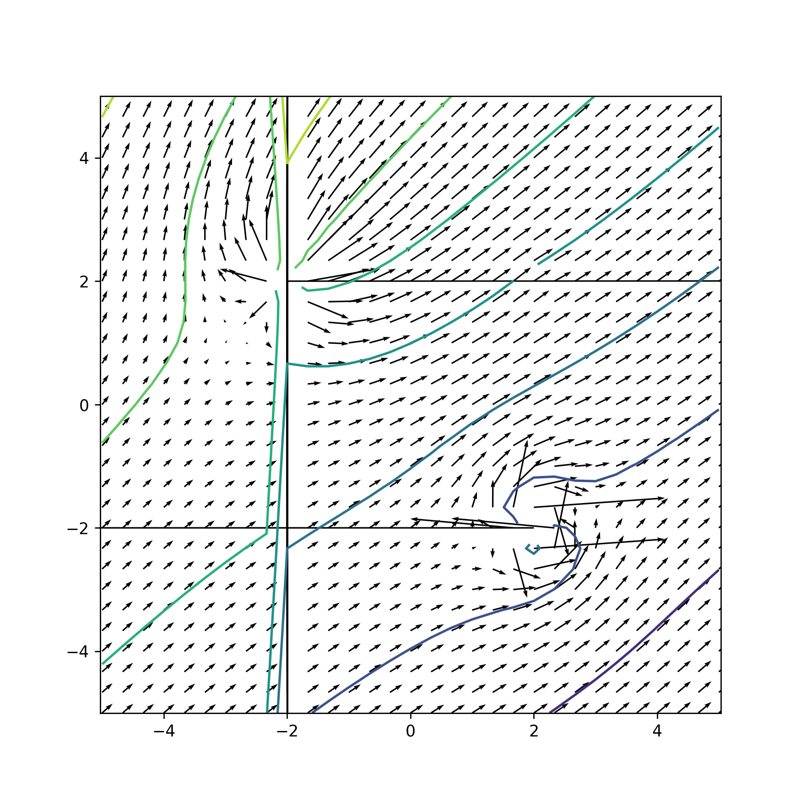

# 流场绘图

---

## 流场绘图能做什么？
通过此库，您可以将四种基本流动叠加在一起，并绘制流场图样。

您可以叠加任意数量、任意种类的流动场，并进行叠加。

## 示例
#### 示例1

```python
from fluid import *


# 自定义一个流场的流函数
def my_stream_funtion(x, y):
    # 叠加均匀流和涡流
    return uniform(x, y, 10, np.pi / 6) + vortex(x, y, 80)


if __name__ == '__main__':
    # 绘图，并绘制等值线
    plot_flow(my_stream_funtion, contour=True)
```
然后，您可以得到下面的图样：


#### 示例2

```python
from fluid import *
import matplotlib.pyplot as plt


# 示例：组合不同流场
def combined_flow(x, y):
    gamma = 1.0  # 涡流强度
    kappa = 2.0  # 偶极子强度
    _lambda = 3.0  # 源（汇）流强度
    velocity = 4.0  # 均匀流速度大小
    theta = np.pi / 4  # 均匀流与x轴夹角

    return vortex(x - 2, y - 2, gamma) + doublet(x - 2, y + 2, kappa) + source(x + 2, y - 2, _lambda) + uniform(x, y,
                                                                                                                velocity,
                                                                                                                theta)


# 绘制组合流场图
# scale=150用于缩放箭头尺寸：在某些情况下，当速度趋近于无穷大的
# 时候，无法正确地自动缩放箭头尺寸，导致图像无法正常显示。
plot_flow(combined_flow, contour=True, scale=150)
```

上面的代码可以得到下面的图像：


更多详细用法请参见`library.py`文件的注释内容。


